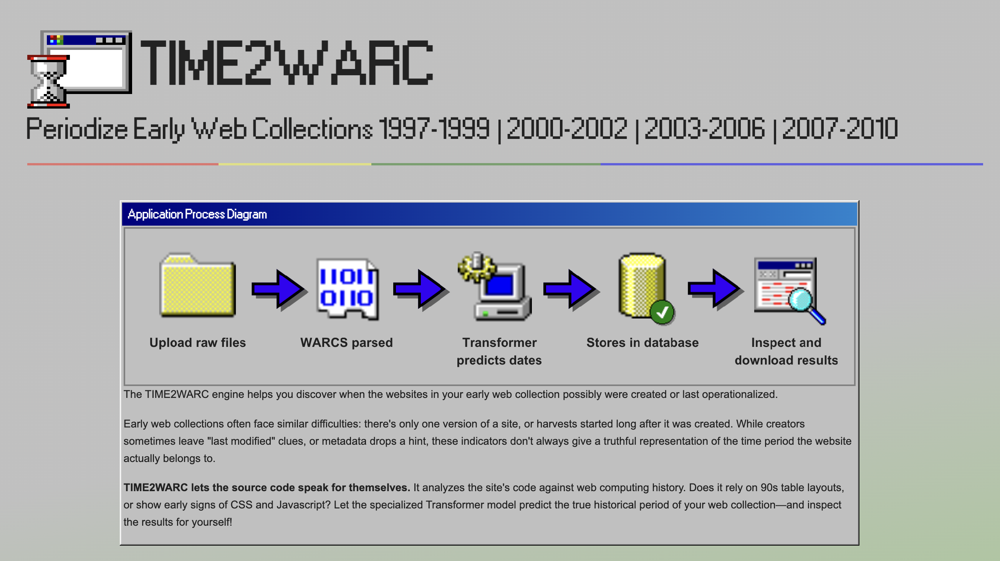
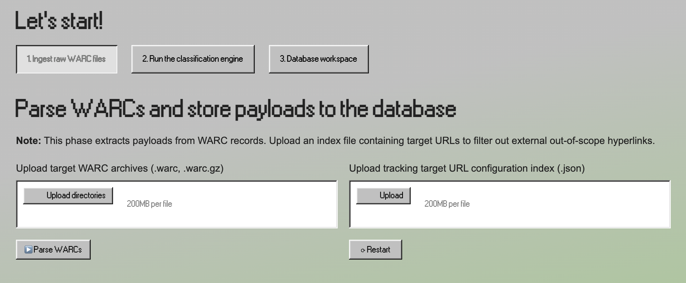
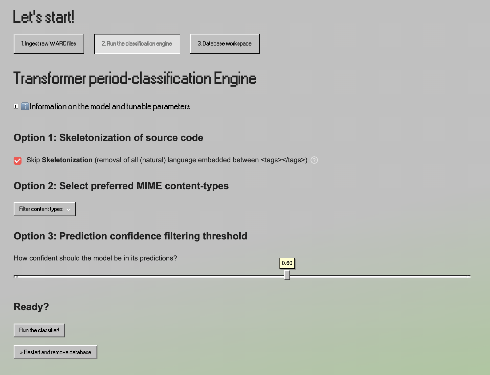
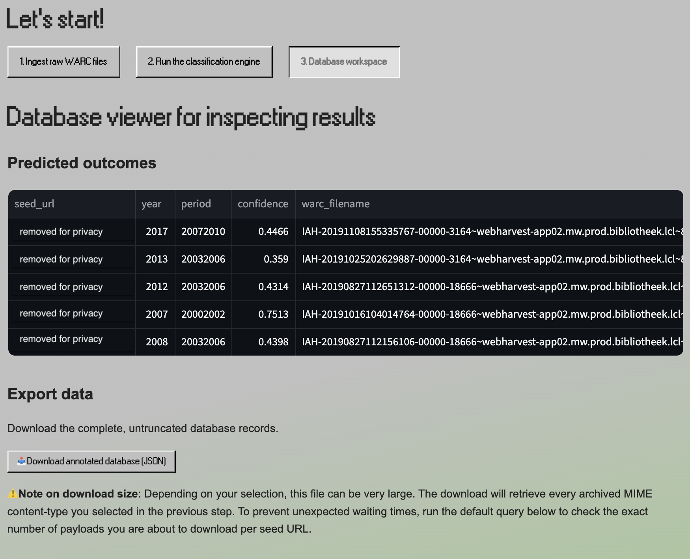
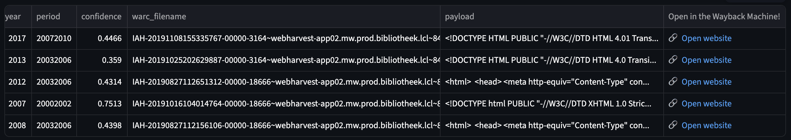
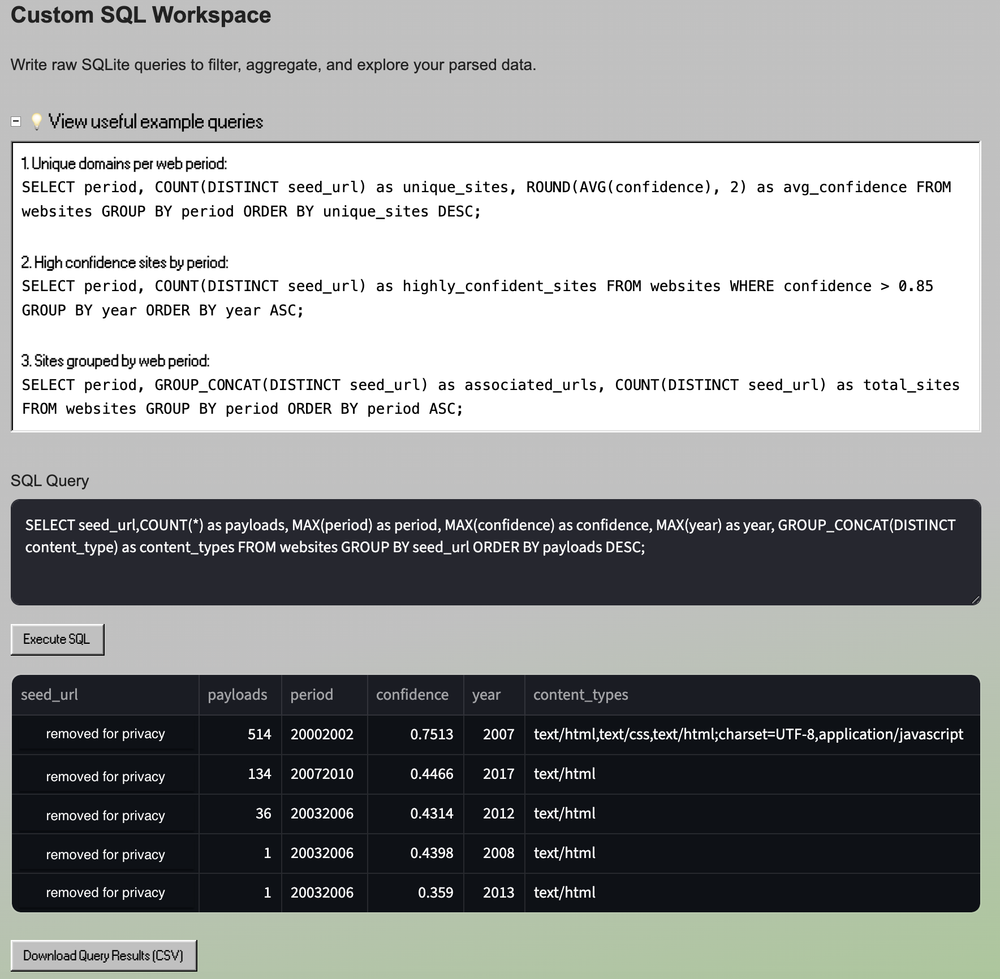

# TIME2WARC

An analytical pipeline and interactive dashboard designed to extract, process, and temporally classify web archives (WARC files). This architecture parses raw web data, extracts HTML payloads, and utilizes a fine-tuned RoBERTa model to predict the creation period of specific domains.

## Project setup & heavy assets

Due to file size constraints, the machine learning models and raw WARC datasets are not hosted in this repository. You must download them manually before running the application.

1. **Download model:** Go to the [Project Google Drive](https://drive.google.com/drive/folders/1hD4UJOc9w4nO8AkgEe01XhjA7MeO2G8t?usp=sharing).
2. **Model weights:** Download the model folder and place it in the root directory of this project so the path looks exactly like this:
   `TIME2WARC/models/v2_3_optimal_weights_fold1/` and `TIME2WARC/models/v2_4_optimal_weights_fold2/`
3. **WARC files:** Download your own warc dataset consisting of `.warc` or `.warc.gz` files and drag them into the dashboard later. 
4. **URL index**: Make sure to also create an `index_warcs.json` file mapping the seed_urls of the warcs which you would like to predict. It should contain the seed url and preferrably a year variable if you know i.e. the last updated year, or else you can fill in None. It should look like this: `{exampleurl.com: 2000}`. Once your environment has set up, drag them into the first step of the interface, you need them to parse the warcs.  
**Note**: The parser allows urls to start with `www.` or `http:`/`https:` by grabbing the domain name with `netloc`. However, for security reasons it's recommended to use the raw domain name such as `{exampleurl.com: 2000}`.

## How to run the application

1. **Clone the repository**
   ```bash
   git clone https://github.com/digitalctrlv/TIME2WARC.git
   ```
   Optional: delete the directory `script_training` which was included for educational purposes. It is not used for running the app.  
   ```bash
   rm -r script_training
   ```

3. **OPTIONAL: Create a virtual environment**  
   It's recommended to create a virtual environment within the directory to install the requirements package. A quick step-by-step guide from: https://www.geeksforgeeks.org/python/create-virtual-environment-using-venv-python/

   Check if venv is already installed
   ```bash
   python -m venv --help
   ```
   If venv is not available, install it.
   ```bash
   sudo apt-get install python3-venv
   ```
   Navigate to the cloned repository (replace .. with the location of your clone)
   ```bash
   cd ../TIME2WARC
   ```
   Create virtualvenv using the command:
   ```bash
   python -m venv venv
   ```

4. **Activate the virtual environment:**
   ```bash
   * Windows (PowerShell): `.venv\Scripts\Activate.ps1`
   * Windows (CMD): `.venv\Scripts\activate.bat`
   * Mac/Linux: `source .venv/bin/activate`

5. **Check python version**  
Before installing the contents of the requirements, check if you have at least python version **3.11**. Namely, some packages are not supported by earlier versions and will throw conflicts.
   ```bash
   python3 --version
   ```
   
6. **Install dependencies (if not already installed):**
   ```bash
   pip install -r requirements.txt

7. **Launch the graphical interface via your terminal and open in a browser**
   ```bash
   streamlit run app.py
   ```
   or (advised) for larger WARC files (max. 2GB):
   
   ```bash
   streamlit run app.py --server.maxUploadSize=2000
   
## Dashboard
  

## Tab 1  
Scans the uploaded_warcs/ directory, initializes the relational SQLite database (websites.db), and extracts the raw text/html payloads from the inputted archive. Also make sure to upload the index provided in the /warcs directory.  


## Tab 2  
Loads the external RoBERTa model and evaluates the extracted HTML payloads. It assigns a predicted temporal period and a statistical confidence score to each domain, writing the outputs directly back to the database.  


## Tab 3  
Displays the final results in an interactive data table. It provides a downloadable JSON file containing the fully annotated dataset, ready for downstream historical analysis.  


## Link to Open Wayback machine  
The final column provides a link that by default redirects you to the wayback machine of the Internet Archive.  


To configure this with your own webarchive, change the `base_url` in `app.py`:
```
# Directs to Internet Archive
base_url = "http://web.archive.org/web/"

# Replace this with your own wayback machine url: e.g. base_url = "http://webarchief.kb:8080"

# Helps to direct to the specific harvest in the given archive by using the WARC timestamp
# timestamp = df_full['warc_filename'].str.extract(r'IAH-(\d{14})', expand=False)
df_full['wayback_link'] = base_url + df_full['seed_url'].astype(str)
```
## SQL custom queries  
Write raw SQLite queries to filter, aggregate, and explore your parsed data.   


## Online version
The online application is not yet live, but is being worked on! Also, it has only been 

## Contributing & support

If you encounter any bugs or unexpected behavior while running **TIME2WARC**, please feel free to:
* **Open an issue:** Drop a bug report directly on the issues tab.
* **Reach out:** Contact me via [Email](mailto:anouk.flinkert@studio.unibo.it).
